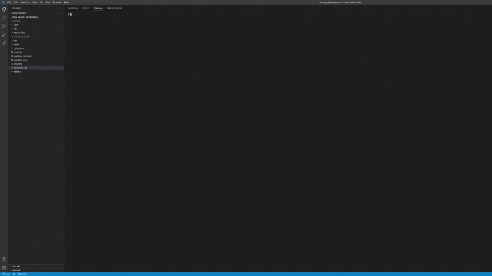
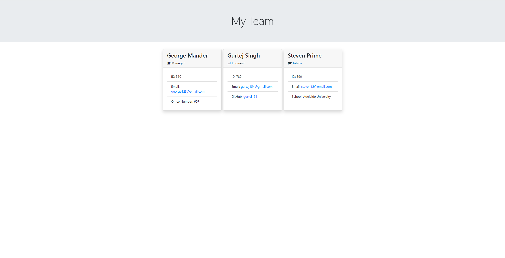

# Team Profile Generator

---

## Table of Contents

- [Description](#description)
- [Installation](#installation)
- [Usage](#usage)
- [Contributing](#contributing)
- [Tests](#tests)
- [Questions](#questions)
- [License](#license)
- [credits](#credits)

---

## Description

Generates a team profile for companies with multiple teams, departments or sub-contractors to use in various types of scenarios.

---

## Installation

Install the following applications to create a team profile;

- Node.js
- Inquirer.js
- Jest.js

---

## Usage

Initiate the command line in terminal and run node index.js to generate a team profile html file.

---

## Contributing

N/A

---

## Tests

[View walk-through](https://drive.google.com/file/d/1hdD7WPjr-YsEvbgtupFJ50iYeewArM_0/view?usp=sharing)

---

## Questions

Any questions regarding the project and the repository itself, please reach out via gurtej154@gmail.com. You can also checkout of my [Github Profile](https://github.com/gurtej154).

---

## License

This repository is licensed under [MIT License](LICENSE)

---

## Credits

N/A
